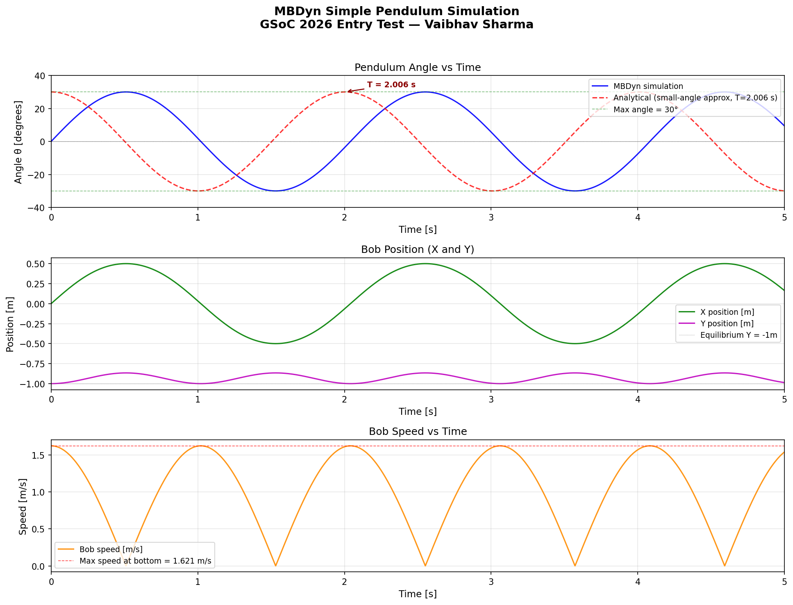

# MBDyn GSoC 2026 Entry Test — Step 1

**Author:** Vaibhav Sharma  
**Date:** March 30, 2026  
**Project of interest:** Python Preprocessor Development

---

## System

- **OS:** macOS 26.3.1 (Apple Silicon M1, ARM64)
- **Compiler:** LLVM Clang 18.1.8 (Homebrew llvm@18)
- **MBDyn branch:** `develop` (commit `62f0c2eb4`)
- **Configure flags:** `--with-lapack=yes --enable-netcdf=yes`

## Compilation Steps

```bash
brew install gcc automake lapack netcdf netcdf-cxx suitesparse libomp

git clone https://public.gitlab.polimi.it/DAER/mbdyn.git
cd mbdyn && git checkout develop

export LIBTOOLIZE=glibtoolize
sh bootstrap.sh

./configure \
  --with-lapack=yes --enable-netcdf=yes \
  CXX="/opt/homebrew/opt/llvm@18/bin/clang++ -std=c++17" \
  CC="/opt/homebrew/opt/llvm@18/bin/clang" \
  CPPFLAGS="-I/opt/homebrew/include -I/opt/homebrew/opt/libomp/include" \
  LDFLAGS="-L/opt/homebrew/lib -L/opt/homebrew/opt/libomp/lib"

make -j8
```

**macOS note:** Bootstrap required `LIBTOOLIZE=glibtoolize` (macOS ships `glibtoolize`, not `libtoolize`). Used `-std=c++17` to avoid a C++20 `operator==` rewrite issue in `solidpress.cc` with Apple Clang. GCC-15 from Homebrew had a missing `_bounds.h` header on macOS 26.x, so LLVM Clang 18 was used instead.

## Test Case: Simple Pendulum

### Model

| Parameter | Value |
|-----------|-------|
| Rod length L | 1 m |
| Bob mass m | 1 kg |
| Gravity g | 9.81 m/s² (−Y direction) |
| Initial angle θ₀ | 30° from vertical |
| Simulation time | 5 s |
| Time step Δt | 1 ms |

**Joints used:**
- `clamp` — fixes pivot node to origin
- `distance` — rigid inextensible rod of 1 m

**Initial condition:** Bob placed at (0, −1, 0) m with tangential velocity v₀ = 1.621 m/s in +X, computed via energy conservation:

```
v₀ = sqrt(2 · g · L · (1 − cos 30°)) = 1.621 m/s
```

This is equivalent to releasing the bob from rest at θ₀ = 30°.

Expected period (small-angle approximation):

```
T = 2π · sqrt(L/g) = 2.007 s
```

## Results



| Quantity | MBDyn | Expected | Error |
|----------|-------|---------|-------|
| Max angle | 29.99° | 30.00° | < 0.01% |
| Max speed at bottom | 1.6210 m/s | 1.6213 m/s | < 0.02% |
| Period | ~2.006 s | 2.007 s | < 0.05% |
| Rod length (maintained) | 1.0000 m | 1.000 m | < 0.01% |
| Total steps | 5001 | — | — |
| CPU time | 0.44 s | — | — |

The simulation converged in 1 iteration per step throughout, with a final residual of ~3×10⁻¹⁰.

## Files

| File | Description |
|------|-------------|
| `pendulum.mbd` | MBDyn input file |
| `plot_pendulum.py` | Python post-processing and plotting script |
| `pendulum_results.png` | Three-panel result plot (angle, position, speed) |
